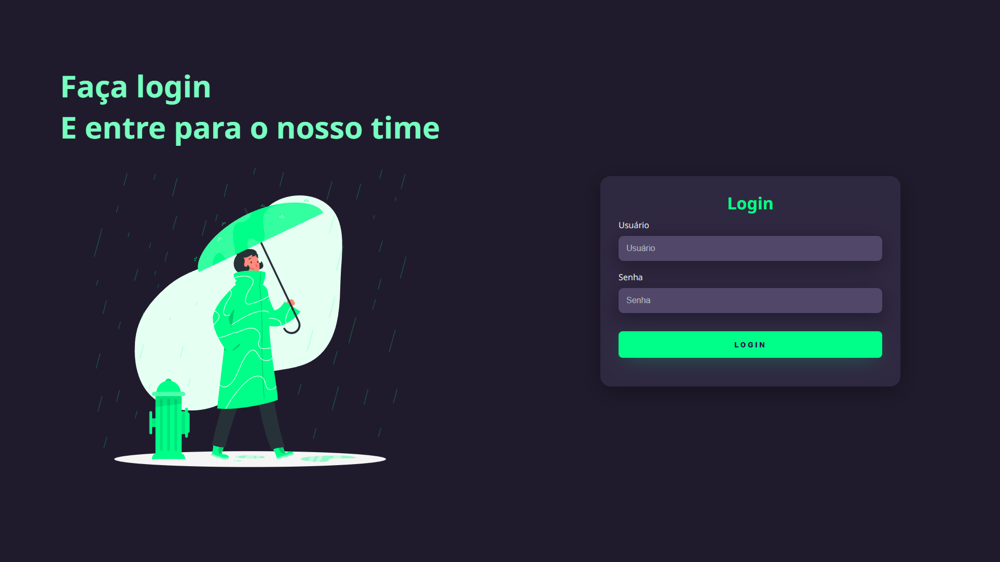
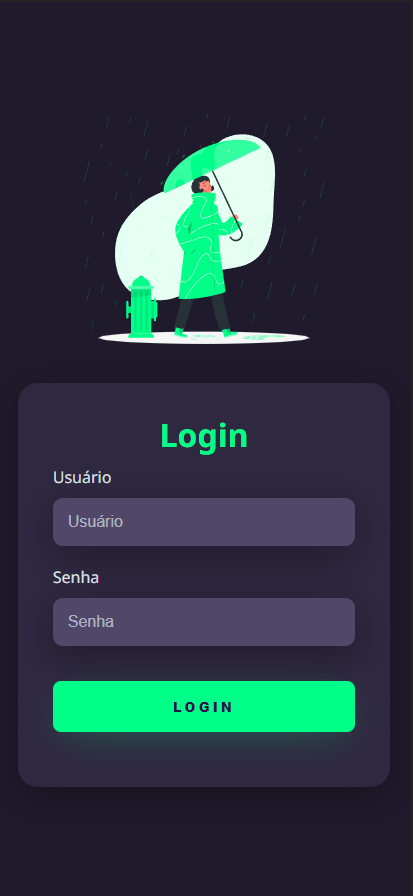

# Responsive-Login

Para o desenvolvimento dessa página de login foi utilizado apenas HTML e CSS, juntamente á uma imagem animada do site StorySet, essa imagem é um svg animado.

Além disso essa página de login com uma paleta de cores dark será totalmente responsiva, ou seja ela funciona em tablet, celular, e computador.

Também foi usado o google fonts para baixar a font Noto Sans.

     
## Web

## Smartphones     
     

